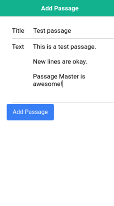
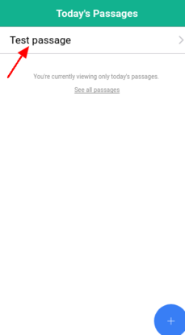
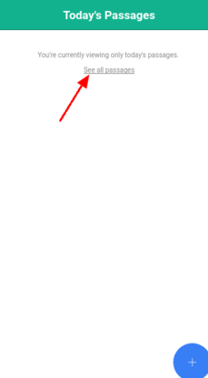

# A Guided Tour of Passage Master

Are you ready to begin your journey towards a mind filled with great writing? Great! To start out, you'll need an account. Go to [passagemaster.com](http://passagemaster.com), and click on the **Get Started** button. This will take you to the login screen. Click **Sign Up**, and either enter your email and a password, or click on one of the blue buttons to login using your Facebook or Google account.

Once you've logged in, you'll see a (currently empty) list of all the passages you need to review today.

You'll also see a link to look at all your passages. We'll come back to that later. For now, click on the button with the plus sign in the bottom right to add your first passage. This will open up a window where you can write or paste in the title and text of your passage. We'll fill it in with some random text for now.

Once you've filled in the title and text of your passage, click **Add Passage**, and you'll be taken back to your passages page. This time, you have a passage!

Now, click on your passage, and you'll see your passage, along with a few options.

Let's check out the review function first. Click the **Review** button, and you'll go into the review screen. It will show you a random portion of your passage, and your goal is to correctly type in the next word. Once you get the word correct, it will light up green, and you can move on.

If you ever want to go back to look at your passage, you can click the arrow in the upper left. Let's do that right now, so we can look at how mastering works.

When you feel like you've mastered a passage, you can click the **Mark as Mastered** button, to mark it as mastered. Before we do that, let's take a break to discuss exactly what 'mastering' a passage means.

Passage Master's review system is based on the Charlotte Mason memorization system, which you can read all about at [Simply Charlotte Mason](https://simplycharlottemason.com/timesavers/memorysys/). In this system, all passages are classified into one of four sections, based on how often they're reviewed. These sections are:

* Daily, for passages you're currently working on.
* Every other day, for passages that were just mastered and will be reviewed on either odd or even dates.
* Weekly, for passages that will be reviewed on a certain day each week.
* Monthly, for passages that will be reviewed on a certain date each month.

When you *master* a passage, Passage Master automatically bumps it up into the next group. This starts a chain reaction that moves the oldest passage in each section up to the section above. In the end, the passages you know the best are reviewed less frequently, and the passages you still need to work on will be reviewed more frequentyly.

Now that we know how mastering works, lets see it in action! Click the **Mark as Mastered** button, and then click the arrow to go back to the passages screen.

What happened to our passage?! Now that it's marked as mastered, we don't need to work on it today. Click on the **See all passages** link to see where it's gone.

Now we can see that our passage hasn't disappeared, it's just moved into a different group (the odd/even group). It'll show up to be reviewed tomorrow. Believe it or not, that's everything you need to know about Passage Master. Now you can start adding in your passages and begin the memorization and review process. Have fun!

If you have any questions, please email [admin@passagemaster.com](mailto:admin@passagemaster.com).